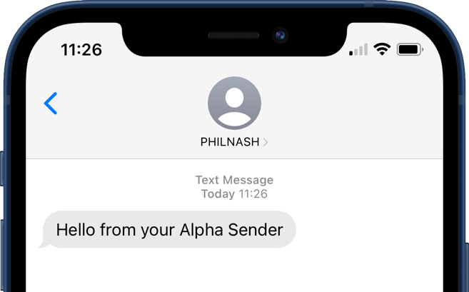

# Send SMS in Twilio without a phone number

This is an example of how to send SMS without a phone number in Ruby. In many countries you can use an alphanumeric sender ID to send messages instead of using a phone number.



To use this code example, you will need to have set up a [Messaging Service](https://www.twilio.com/docs/messaging/services) with an alphanumeric sender ID in the pool. To see the steps required, please follow the steps in this blog post: [How to send SMS without a phone number using an alphanumeric sender ID and Ruby]().

## Running the project

To run this project you will need an upgraded Twilio account (you can't send messages from an alpha sender with a trial account) and a Messaging Service with an alpha sender in the pool. Gather your Twilio Account Sid and Auth Token from the [Twilio console](https://console.twilio.com/?frameUrl=/console) and your Messaging Service Sid from the [Messaging Services section](https://console.twilio.com/us1/develop/sms/services?frameUrl=%2Fconsole%2Fsms%2Fservices%3Fx-target-region%3Dus1).

You will also need [Ruby](https://www.ruby-lang.org/en/documentation/installation/) and [Bundler](https://bundler.io/) installed.

Clone the project, change into the directory and install the dependencies:

```bash
git clone https://github.com/philnash/send-sms-with-twilio-alphanumeric-sender-ruby.git
cd send-sms-with-twilio-alphanumeric-sender-ruby
bundle install
```

Copy the `.env.example` file to `.env`:

```bash
cp .env.example .env
```

Then open the `.env` file and enter your Twilio Account Sid, Auth Token and Messaging Service Sid.

### Send a message

To send a message, run the `send-sms.rb` file on the command line and pass in the phone number you want to send the message to as the first argument:

```bash
bundle exec ruby ./send-sms.rb +YOUR_PHONE_NUMBER
```